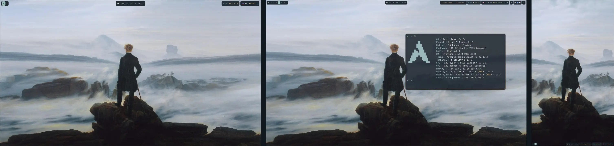

# Fog & Ember for Hyprland

A portable, cohesive Hyprland desktop for **Arch Linux, EndeavourOS, Manjaro
and Fedora**.



The repository installs both the configuration and its desktop dependencies.
A clean system does not need to have Hyprland, Waybar, Ghostty, Rofi, Wofi
or Thunar preinstalled.

## Included

- Hyprland Lua configuration;
- universal automatic monitor fallback plus local overrides;
- Waybar;
- Ghostty;
- Rofi and Wofi;
- Thunar integration;
- Mako notifications;
- Hyprlock and Hypridle;
- screenshots with Grim, Slurp and wl-clipboard;
- clipboard history with Cliphist;
- Git/GitHub tooling: an anonymized `.gitconfig`, `delta`, `diffnav`, `tuicr`, `gh` and OpenSSH;
- PipeWire controls, NetworkManager and Bluetooth widgets;
- GTK, icon, terminal and launcher colors generated from one **Fog & Ember**
  palette;
- backup, restore and diagnostics.

GPU drivers, kernels, microcode, boot loaders, VPN profiles, browsers and
personal applications are deliberately not managed.

## Install

```bash
git clone https://github.com/Avdushin/hyprland.git
cd hyprland
./install.sh
```

The installer:

1. detects the supported distribution family;
2. installs required packages;
3. preserves personal `user.*` / `credential.*` values from an existing `~/.gitconfig` in `~/.gitconfig.local` when needed;
4. backs up existing managed configuration;
5. installs dotfiles and wallpapers;
6. generates theme fragments;
7. enables relevant services;
8. runs diagnostics.

Log out afterward and choose **Hyprland** in the display manager.

## Safe previews and partial installation

Print package-manager actions without changing anything:

```bash
./install.sh --dry-run
```

Install only the files, after dependencies were installed manually:

```bash
./install.sh --dotfiles-only
```

Skip post-install diagnostics:

```bash
./install.sh --no-doctor
```

## Distribution notes

- Arch Linux, EndeavourOS and Manjaro use `pacman`.
- Fedora uses the Hyprland COPR currently referenced by the upstream
  installation documentation.
- Other Linux distributions can use `--dotfiles-only`; their package managers
  are not claimed as tested or automated.

Hyprland upstream officially guarantees first-class packaging support only for
a limited set of distributions. This project therefore keeps distro logic
isolated and avoids mixing manually built Hyprland ecosystem libraries with
distribution packages.

## Monitor layout

The default profile uses preferred modes and automatic placement. Create a
local profile for exact geometry:

```bash
cp ~/.config/hypr/monitors/local.lua.example \
   ~/.config/hypr/monitors/local.lua
```

See [monitor documentation](docs/MONITORS.md).

## Update

```bash
git pull --ff-only
./install.sh
```

A new dated backup is created every time.

## Documentation

- [Key bindings](docs/KEYBINDS.md)
- [Git and terminal tooling](docs/GIT.md)
- [Neovim (separate repository)](docs/NVIM.md)
- [Monitor setup](docs/MONITORS.md)
- [Distribution support](docs/DISTRIBUTIONS.md)
- [Customization](docs/CUSTOMIZATION.md)
- [Troubleshooting](docs/TROUBLESHOOTING.md)

## License

MIT
