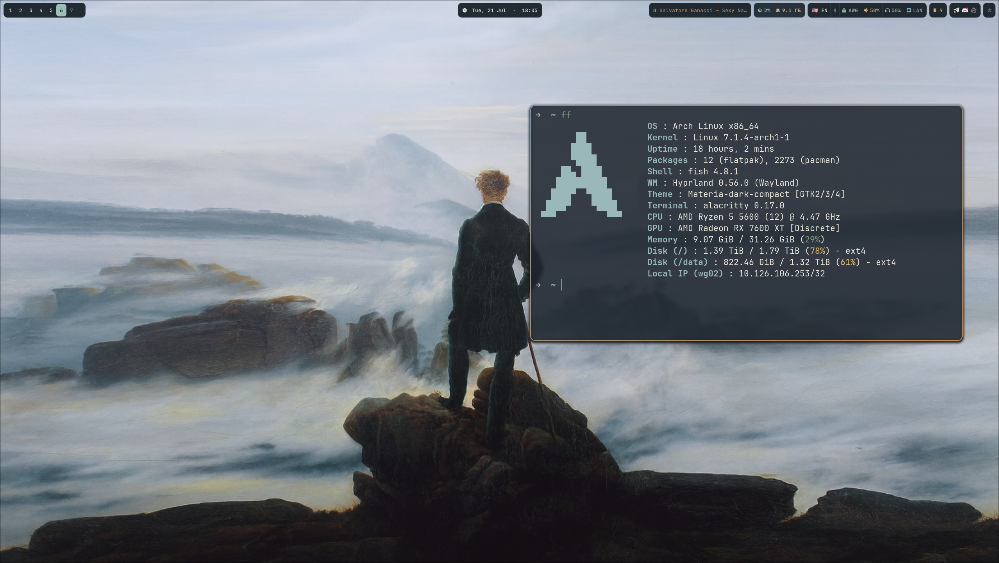
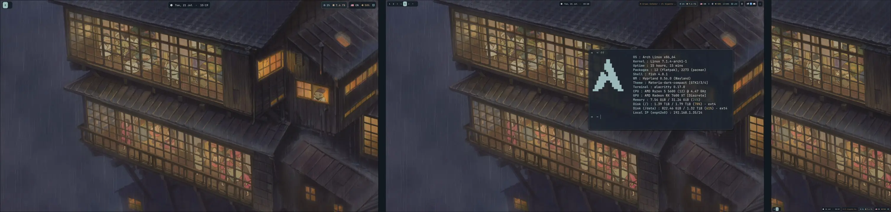

#  Hyprland - Fog & Ember 

Переносимая и цельная сборка рабочего окружения Hyprland для **Arch Linux, EndeavourOS, Manjaro и Fedora**.






Репозиторий устанавливает как саму конфигурацию, так и необходимые для неё компоненты рабочего окружения. На чистой системе не требуется заранее устанавливать Hyprland, Waybar, Ghostty, Rofi, Wofi или Thunar.

## Что входит в сборку

* конфигурация Hyprland на Lua;
* универсальное автоматическое определение мониторов с возможностью локального переопределения;
* Waybar;
* Ghostty;
* Rofi и Wofi;
* интеграция с Thunar;
* уведомления Mako;
* Hyprlock и Hypridle;
* создание скриншотов с помощью Grim, Slurp и wl-clipboard;
* история буфера обмена через Cliphist;
* управление PipeWire, виджеты NetworkManager и Bluetooth;
* единая палитра **Fog & Ember**, из которой генерируются цвета GTK, иконок, терминала, лаунчеров и других компонентов;
* резервное копирование, восстановление и диагностика.

Драйверы видеокарты, ядра, микрокод, загрузчики, VPN-профили, браузеры и личные приложения намеренно не устанавливаются и не изменяются.

## Установка

```bash
git clone https://github.com/Avdushin/hyprland.git
cd hyprland
./install.sh
```

Установщик:

1. определяет поддерживаемое семейство дистрибутива;
2. устанавливает необходимые пакеты;
3. создаёт резервную копию существующих управляемых конфигураций;
4. устанавливает dotfiles и обои;
5. генерирует файлы цветовой темы;
6. включает необходимые службы;
7. запускает диагностику.

После установки выйдите из текущей сессии и выберите **Hyprland** в менеджере входа.

## Предварительный просмотр и частичная установка

Показать действия пакетного менеджера без внесения изменений:

```bash
./install.sh --dry-run
```

Установить только конфигурационные файлы, если зависимости уже были установлены вручную:

```bash
./install.sh --dotfiles-only
```

Пропустить диагностику после установки:

```bash
./install.sh --no-doctor
```

## Поддержка дистрибутивов

* Arch Linux, EndeavourOS и Manjaro используют `pacman`.
* Fedora использует COPR-репозиторий Hyprland, указанный в актуальной документации проекта.
* На других дистрибутивах можно использовать параметр `--dotfiles-only`, однако автоматическая установка через их пакетные менеджеры не заявлена как протестированная или поддерживаемая.

Разработчики Hyprland официально гарантируют полноценную поддержку пакетной установки только для ограниченного числа дистрибутивов. Поэтому логика установки для разных систем в этом проекте разделена, а библиотеки экосистемы Hyprland, собранные вручную, не смешиваются с пакетами дистрибутива.

## Настройка мониторов

Профиль по умолчанию использует предпочтительные режимы мониторов и автоматическое расположение.

Для точной настройки разрешения, частоты обновления, масштаба и расположения создайте локальный профиль:

```bash
cp ~/.config/hypr/monitors/local.lua.example \
   ~/.config/hypr/monitors/local.lua
```

Подробнее: [настройка мониторов](docs/MONITORS.md).

## Обновление

```bash
git pull --ff-only
./install.sh
```

При каждом запуске создаётся новая резервная копия с датой и временем.

## Документация

* [Горячие клавиши](docs/KEYBINDS.md)
* [Настройка мониторов](docs/MONITORS.md)
* [Поддержка дистрибутивов](docs/DISTRIBUTIONS.md)
* [Настройка и персонализация](docs/CUSTOMIZATION.md)
* [Решение проблем](docs/TROUBLESHOOTING.md)

## Лицензия

MIT
