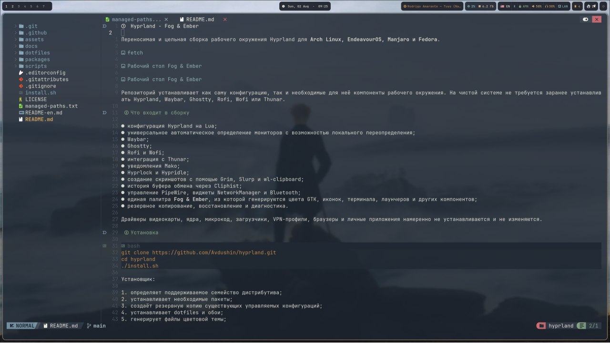
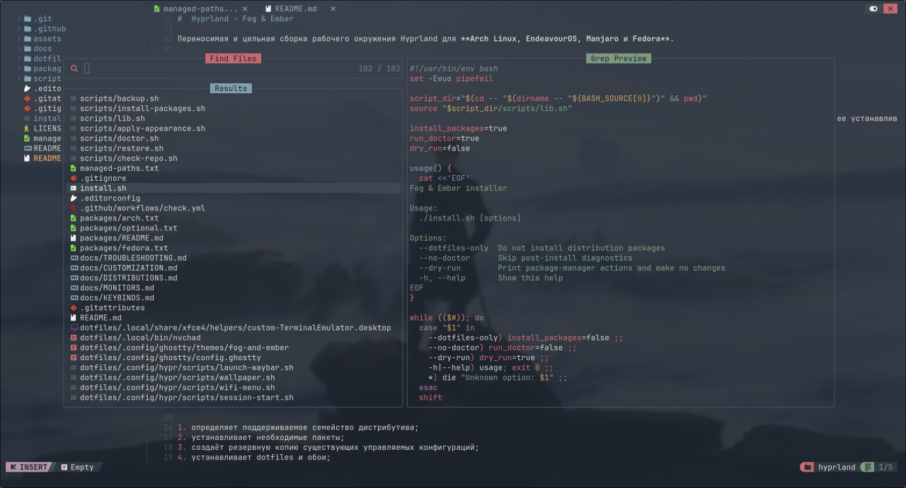
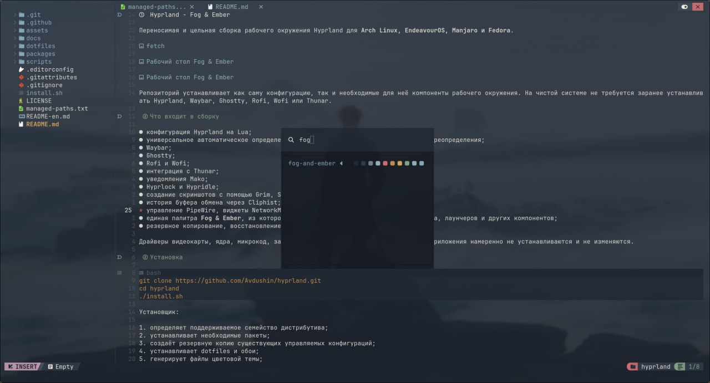

# Neovim / NvChad







В сборку входит конфигурация Neovim на базе **NvChad v2.5** с темой
**Fog & Ember**, прозрачным интерфейсом, LSP, форматированием, поиском и
заменой по проекту, мультикурсором и быстрыми заметками.

## Установка и запуск

Конфигурация устанавливается в:

```text
~/.config/nvim
```

Дополнительный launcher:

```text
~/.local/bin/nvchad
```

Он удаляет переменную `NVIM_APPNAME` перед запуском, поэтому использует
основной профиль `~/.config/nvim`.

Запуск:

```bash
nvim
```

или:

```bash
nvchad
```

При первом запуске `lazy.nvim` автоматически скачает плагины.

Управление плагинами:

```vim
:Lazy
```

Установка и обновление:

```vim
:Lazy sync
```

## Что входит в конфигурацию

- NvChad и Base46;
- тема Fog & Ember и альтернативная тема Gruvbox;
- Telescope для поиска файлов, текста и буферов;
- NvimTree для дерева файлов;
- Conform для форматирования;
- встроенный LSP-клиент Neovim;
- Grug FAR для поиска и замены;
- `render-markdown.nvim` для Markdown;
- `image.nvim` для изображений в Markdown;
- `nvim-surround` для окружений;
- `vim-visual-multi` для нескольких курсоров;
- Tabnine и стандартное дополнение NvChad;
- встроенные терминалы NvChad;
- Draft, Note, Notes, Scratch и ClipEdit.

## Обозначения клавиш

| Обозначение | Значение |
|---|---|
| `<leader>` | `Space` |
| `<localleader>` | обратный слеш `\` |
| `Ctrl` | клавиша Control |
| `Alt` | клавиша Alt |
| `Shift` | клавиша Shift |
| Normal | обычный режим Neovim |
| Insert | режим ввода текста |
| Visual | режим выделения |
| Terminal | режим терминала |

Последовательности с `leader` нажимаются по очереди. Например:

```text
Space → n → d
```

Удерживать `Space` не требуется.

## Пользовательские сочетания

### Основные действия

| Сочетание | Режим | Действие |
|---|---|---|
| `;` | Normal | открыть командную строку Neovim |
| `jk` | Insert | выйти в Normal mode |
| `Ctrl+P` | Normal | найти файл через Telescope и ripgrep |
| `Ctrl+B` | Normal | открыть или закрыть NvimTree |
| `Ctrl+N` | Normal | создать новый пустой буфер |
| `Ctrl+W` | Normal | закрыть текущий буфер |
| `Ctrl+1` … `Ctrl+9` | Normal | перейти к буферу с соответствующим номером |
| `Space c` | Normal | скопировать относительный путь текущего файла |
| `Space d` | Normal | продублировать текущую строку вниз |
| `Ctrl+Shift+I` | Normal | отформатировать текущий файл |
| `Space ut` | Normal | переключить Fog & Ember и Gruvbox |

`Ctrl+P` включает скрытые файлы, но исключает каталог `.git`.

### Перемещение строк

| Сочетание | Режим | Действие |
|---|---|---|
| `Ctrl+Shift+Down` | Normal | переместить строку вниз |
| `Ctrl+Shift+Up` | Normal | переместить строку вверх |
| `Ctrl+Shift+Down` | Insert | переместить строку вниз и вернуться в Insert |
| `Ctrl+Shift+Up` | Insert | переместить строку вверх и вернуться в Insert |
| `Ctrl+Shift+Down` | Visual | переместить выделенный блок вниз |
| `Ctrl+Shift+Up` | Visual | переместить выделенный блок вверх |

### Кавычки внутри круглых скобок

Курсор должен находиться внутри круглых скобок.

Исходный текст:

```python
print(hello)
```

| Сочетание | Действие |
|---|---|
| `Space "` | обернуть содержимое скобок в двойные кавычки |
| `Space q` | переключать тип кавычек |

Последовательность:

```text
hello → "hello" → 'hello' → `hello` → "hello"
```

Также установлен `nvim-surround` со стандартными командами:

| Команда | Действие |
|---|---|
| `ys` | добавить окружение |
| `ds` | удалить окружение |
| `cs` | заменить окружение |

## Терминалы

| Сочетание | Режим | Действие |
|---|---|---|
| `Ctrl+\`` | Normal или Terminal | открыть или закрыть нижний терминал |
| `Ctrl+E` | Normal или Terminal | открыть или закрыть терминал справа |
| `Ctrl+Shift+T` | Normal или Terminal | открыть или закрыть плавающий терминал |
| `Space tt` | Normal | открыть новый терминал во вкладке |

Повторное нажатие открывает тот же терминал с сохранённой сессией.

## Поиск и замена

Для поиска и замены используется **Grug FAR**.

| Сочетание | Область поиска |
|---|---|
| `Ctrl+Shift+F` | Git-проект или каталог текущего файла |
| `Space sr` | Git-проект или каталог текущего файла |
| `Space sf` | только текущий файл |
| `Space sw` | проект со словом под курсором в поле поиска |

Область поиска определяется автоматически:

1. корень текущего Git-репозитория;
2. каталог текущего файла, если Git-репозитория нет;
3. текущая рабочая директория для безымянного буфера.

В окне Grug FAR доступны поля:

```text
Search
Replace
Files Filter
Flags
Paths
```

После заполнения `Search` и `Replace` перейдите в Normal mode и нажмите:

```text
\r
```

Основные действия внутри Grug FAR:

| Сочетание | Действие |
|---|---|
| `\r` | выполнить замену |
| `\s` | синхронизировать все вручную изменённые результаты |
| `\l` | синхронизировать текущую строку |
| `\n` | синхронизировать следующее изменение |

### Конфликт с Ghostty

Ghostty может перехватывать `Ctrl+Shift+F` и `Ctrl+Shift+I`.

Чтобы передавать эти сочетания в Neovim, добавьте в конфигурацию Ghostty:

```ini
keybind = ctrl+shift+f=unbind
keybind = ctrl+shift+i=unbind
```

Функции Ghostty можно перенести:

```ini
keybind = ctrl+alt+f=start_search
keybind = ctrl+alt+i=inspector:toggle
```

## Несколько курсоров

Для нескольких курсоров используется `vim-visual-multi`.

| Сочетание | Действие |
|---|---|
| `Ctrl+D` | выбрать слово и следующее совпадение |
| `Alt+D` | выбрать предыдущее совпадение |
| `Alt+J` | добавить курсор строкой ниже |
| `Alt+K` | добавить курсор строкой выше |
| `Esc` | завершить работу с несколькими курсорами |

## Быстрые заметки

Постоянные заметки находятся в:

```text
~/Workspace/notes
```

Структура:

```text
~/Workspace/notes/
├── draft.md
└── inbox/
    └── YYYY-MM-DD_HH-MM-SS_название.md
```

### Сочетания и команды

| Сочетание | Команда | Действие |
|---|---|---|
| `Space nd` | `:Draft` | открыть постоянный `draft.md` |
| `Space nn` | `:Note` | создать новую заметку |
| `Space nf` | `:Notes` | найти заметку через Telescope |
| `Space ns` | `:Scratch` | открыть временный Markdown-буфер |
| `Space nc` | `:ClipEdit` | отредактировать системный clipboard |

### Draft

Команда:

```vim
:Draft
```

открывает:

```text
~/Workspace/notes/draft.md
```

### Создание заметки

```vim
:Note Название заметки
```

создаёт файл в `~/Workspace/notes/inbox`.

Без аргумента:

```vim
:Note
```

Neovim запросит название интерактивно.

Новая заметка получает заголовок и дату создания:

```markdown
# Название заметки

Создано: 2026-08-02 09:00
```

### Автосохранение

Файлы внутри `~/Workspace/notes` автоматически сохраняются при:

- выходе из Insert mode;
- переходе в другой буфер;
- потере фокуса окном Neovim.

### Scratch

`:Scratch` создаёт временный Markdown-буфер без файла, swap и постоянной
истории undo.

### ClipEdit

`:ClipEdit` загружает системный clipboard в отдельный буфер.

После редактирования выполните:

```vim
:w
```

Текст будет записан обратно в clipboard.

## Форматирование

Форматирование выполняется при сохранении файла. Тайм-аут — 500 мс. Если
formatter отсутствует, используется LSP fallback.

| Тип файлов | Formatter |
|---|---|
| Lua | `stylua` |
| HTML | `prettier` |
| CSS и SCSS | `prettier` |
| JSON | `prettier` |
| Markdown | `prettier` |
| JavaScript и JSX | `prettier` |
| TypeScript и TSX | `prettier` |
| Python | `black` |
| Go | `gofmt` |
| Rust | `rustfmt` |

Проверка Conform:

```vim
:ConformInfo
```

Formatter должен быть установлен в системе и доступен через `$PATH`.

## LSP

В конфигурации включены:

| Язык | LSP |
|---|---|
| HTML | `html` |
| CSS | `cssls` |
| JavaScript и TypeScript | `tsserver` |
| JSON | `jsonls` |
| Markdown | `marksman` |
| Rust | `rust_analyzer` |
| Go | `gopls` |
| Python | `pyright` |

Проверка:

```vim
:LspInfo
```

Управление инструментами:

```vim
:Mason
```

## Темы и прозрачность

Основная тема:

```text
Fog & Ember
```

Альтернативная:

```text
Gruvbox
```

Переключение:

```text
Space → u → t
```

Основные цвета Fog & Ember:

| Назначение | Цвет |
|---|---|
| Фон | `#1B222C` |
| Основной текст | `#EAE6DD` |
| Выделение | `#3B4854` |
| Красный | `#CF6C73` |
| Зелёный | `#82A184` |
| Янтарный | `#D0A35D` |
| Синий | `#86A5B6` |
| Фиолетовый | `#A7849B` |
| Бирюзовый | `#8DAFB1` |

Прозрачность задаётся в:

```text
~/.config/nvim/lua/chadrc.lua
```

```lua
transparency = true
```

На итоговый вид влияют параметры Ghostty:

```ini
background-opacity = 0.84
background-opacity-cells = true
```

Более читаемый гибридный вариант:

```ini
background-opacity = 0.90
background-opacity-cells = false
```

## Markdown и изображения

Для Markdown используется `render-markdown.nvim`, который улучшает
отображение заголовков, списков, таблиц, блоков кода и чекбоксов.

Для изображений используется `image.nvim`:

```lua
backend = "kitty"
processor = "magick_cli"
```

Для обработки изображений нужен ImageMagick:

```bash
magick --version
```

## Кэш Base46

Base46 хранит скомпилированные цвета в:

```text
~/.local/share/nvim/base46
```

Конфигурация автоматически восстанавливает кэш, если он отсутствует.

Принудительная пересборка:

```bash
rm -rf ~/.local/share/nvim/base46
nvim
```

## Диагностика

Активный каталог конфигурации:

```vim
:lua print(vim.fn.stdpath("config"))
```

Ожидаемый результат:

```text
/home/user/.config/nvim
```

Текущая тема:

```vim
:lua print(require("nvconfig").base46.theme)
```

Leader и localleader:

```vim
:lua vim.print({
  leader = vim.g.mapleader,
  localleader = vim.g.maplocalleader,
})
```

Все сочетания:

```vim
:Telescope keymaps
```

Общая диагностика:

```vim
:checkhealth
```

## Основные файлы

| Файл | Назначение |
|---|---|
| `init.lua` | загрузка Lazy, NvChad, Base46 и пользовательских модулей |
| `lua/chadrc.lua` | тема, прозрачность и highlight overrides |
| `lua/mappings.lua` | пользовательские сочетания |
| `lua/options.lua` | настройки Neovim |
| `lua/notes.lua` | Draft, Note, Notes, Scratch и ClipEdit |
| `lua/configs/conform.lua` | форматирование |
| `lua/configs/lspconfig.lua` | LSP-серверы |
| `lua/plugins/` | пользовательские плагины |
| `lua/themes/fog-and-ember.lua` | тема Fog & Ember |
| `lazy-lock.json` | зафиксированные версии плагинов |
